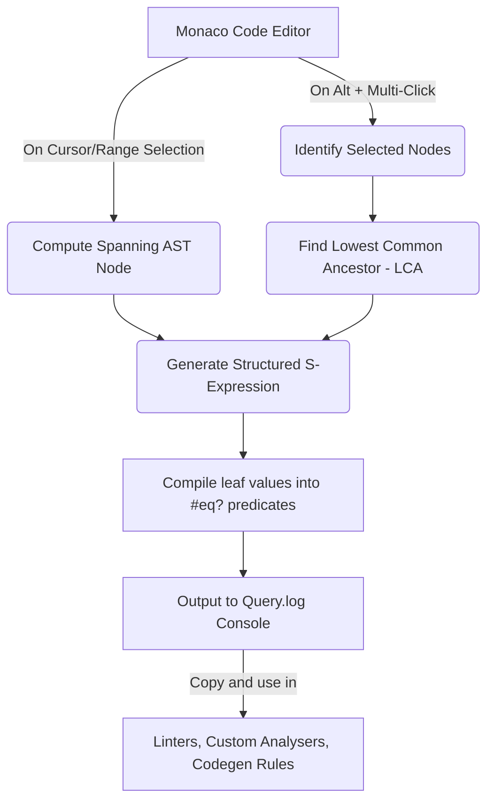

# AST Finder — Tree-Sitter AST Explorer

An interactive, premium developer tool designed for real-time visualization, exploration, and structured query compilation of **Abstract Syntax Trees (AST)**. Powered by **Web Tree-Sitter (WASM)** and the **Monaco Editor**, AST Finder is built to help engineers understand, traverse, and write high-fidelity syntactical queries for their codebase (currently optimized with full support for **Dart & Flutter**).

AST Finder stands out by introducing a custom **Dual-Mode Query Generator** that lets developers draft complex Tree-Sitter S-expression query rules visually by simply highlighting or clicking code elements.

---

## Key Features

AST Finder is packed with advanced features that bridge the gap between abstract syntax tree exploration and practical static analysis rule creation:

### 1. Real-Time WASM-Powered Parsing
* **Instant Processing:** Features a full client-side compilation pipeline. The editor parses code into a syntax tree on every keystroke using high-performance `web-tree-sitter` WebAssembly binaries.
* **Active Status Diagnostics:** Live parser health and compilation indicators (Ready / Initializing / Error) built into the header bar.

### 2. Syntax Recovery & Auto-Wrapping
* **Isolated Snippet Support:** Most parser setups fail when trying to parse isolated statements, widget declarations, or code blocks that aren't wrapped inside complete standard class/method definitions.
* **Auto-Correction Layer:** If raw code has structural errors, AST Finder dynamically wraps the input inside a virtual container block (`void _wrapper() { ... }`), parses the clean AST, and mathematically offsets rows back to the actual editor lines.

### 3. Connector-Based AST Tree Hierarchy
* **Premium CLI Aesthetics:** A custom directory-style tree representation displaying named and anonymous nodes with precise connector symbols (`├──`, `└──`) and hierarchy guidelines.
* **Bidirectional Syncing:** 
  * Clicking an AST node scrolls the Monaco Editor to highlight and select the node's precise coordinates.
  * Moving your editor cursor dynamically shifts focus and highlights the deepest matching node in the AST tree view.

### 4. Dual-Mode Visual Query Generator
Create syntax-matching rules without writing complex query DSL by hand:
* **Mode 1: Range Selection (Drag-and-Select):** Highlight a range of code in the editor, and the generator automatically compiles the narrowest nested S-expression query matching that structure, complete with exact-text `#eq?` predicates for child leaf tokens.
* **Mode 2: Scattered Alt-Click Selection (Lowest Common Ancestor - LCA):** Hold `Alt` and click scattered tokens across the codebase. The engine computes the **LCA (Lowest Common Ancestor)** node, maps paths to the clicked elements, and builds a sparse query structure ignoring unrelated sibling noise.

### 5. Retro Windows CLI Console Panel
A retro command prompt command-line interface with dual logging channels:
* **`[Query.log]`**: Real-time compilation of the visually generated query. Features one-click clipboard copying to easily export rules for custom static analyzers or linters.
* **`[Tree.log]`**: A custom S-expression recursive pretty-printer. Formats the standard stringified tree (`tree.rootNode.toString()`) into a human-readable, multi-line nested format.

### 6. Dynamic Query Editor & Highlighting
* **Custom DSL Compilation:** Write raw Tree-Sitter queries (matching standard patterns and predicates like `#eq?` and `#match?`) directly into the Query Input.
* **Live Match Annotations:** Matches are highlighted instantly in the Monaco Editor and annotated with dedicated styling across the AST Tree View.

---

## Tech Stack

* **Core Framework:** React 19 (Functional Components, `useMemo`, `useCallback`, Hooks-based state lifecycle)
* **Build System:** Vite
* **Styling:** Tailwind CSS v4 & custom HSL tailored light/dark utility tokens
* **Code Editor:** Monaco Editor (`@monaco-editor/react`)
* **AST Parser:** Web Tree-Sitter (`web-tree-sitter`) compiled with WebAssembly
* **Design Pattern:** Elegant modern-minimal interface contrasted with a sleek, vintage terminal console for visual excellence.

---

## Project Structure

```bash
AST Finder/
├── public/
│   └── tree-sitter-dart.wasm    # Compiled Tree-Sitter binary for Dart parsing
├── src/
│   ├── components/
│   │   ├── ASTTreeNode.jsx      # Individual visual node in the AST tree view
│   │   ├── ASTTreeView.jsx      # Connector-based Tree-list hierarchy generator
│   │   ├── CodeEditor.jsx       # Monaco Editor wrapper with event bindings and themes
│   │   ├── CommandPanel.jsx     # Retro Windows CLI console component
│   │   ├── LanguageSelector.jsx # Custom UI language selector
│   │   ├── LeftPane.jsx         # Left split container (Editor + Custom query input)
│   │   ├── QueryInput.jsx       # Custom S-expression query debugger
│   │   └── RightPane.jsx        # Right split container (Tree View + Terminal console)
│   ├── hooks/
│   │   └── useTreeSitter.js     # Manages WASM init, parsing lifecycle, & query runner
│   ├── utils/
│   │   └── astHelpers.js        # S-expression pretty printer, LCA search, & query compilers
│   ├── App.jsx                  # Application shell and state-coordination hub
│   ├── index.css                # Global design system variables & micro-animations
│   └── main.jsx                 # React DOM mount entrypoint
├── index.html                   # HTML Entry template with responsive typography
├── package.json                 # Dependency manifests & script configs
├── vite.config.js               # Vite build and asset serving definitions
└── test_ast.mjs                 # Node.js validation test script for the AST queries
```

---

## Architectural Insights

### The Visual Query Compilation Loop



### Custom LCA Query Algorithm
When a developer `Alt` + clicks multiple tokens (e.g., scattered identifiers across a nested layout), the query builder:
1. Calculates ancestral chains up to the root node for each clicked node.
2. Traverses from the clicked nodes upward to locate the first intersection point: the **Lowest Common Ancestor (LCA)**.
3. Performs a depth-first search (DFS) beginning at the LCA, exclusively marking active path branches leading to target nodes.
4. Serializes only active branches into the resulting S-expression query structure, ensuring clean, targeted query compilation.

---

## Getting Started

### Prerequisites
Ensure you have **Node.js (v18.x or later)** and **npm** installed on your machine.

### Installation
1. Clone the repository and navigate to the project directory:
   ```bash
   cd "AST Finder"
   ```
2. Install the package dependencies:
   ```bash
   npm install
   ```

### Running the Development Server
Launch the local Vite server:
```bash
npm run dev
```
Open your browser and navigate to the provided local URL (default is `http://localhost:5173`).

### Building for Production
To bundle the application into static HTML/JS/CSS assets ready for hosting:
```bash
npm run build
```
Verify the production build using the preview server:
```bash
npm run preview
```

---

## Example Query Usage

To search for a specific nested structure, paste a valid Tree-Sitter S-expression in the **Query Input** box.

### Matching Flutter Image.network Widgets
For example, to find any `Image.network` widget with a specific URL argument:

```scheme
(named_argument
  (identifier) @var_identifier
  (selector
    (unconditional_assignable_selector
      (identifier) @var_identifier_1))
  (selector
    (argument_part
      (arguments
        (argument
          (string_literal) @var_string_literal))))
  (#eq? @var_identifier "Image")
  (#eq? @var_identifier_1 "network")
  (#eq? @var_string_literal "'https://placekitten.com/200/200'")
)
```

Matches will immediately glow with visual highlights in the Monaco Editor and be outlined in light cyan in the AST tree hierarchy list.

---

## License

This project is licensed under the MIT License - see the [LICENSE](LICENSE) file for details.
