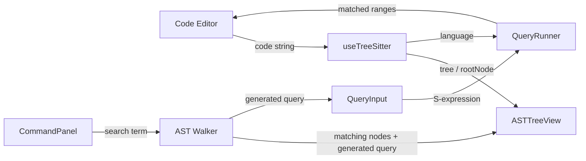

# AST Finder — Implementation Plan

A premium, full-screen web application for parsing Dart code into an AST using **web-tree-sitter**, visualizing the tree, and running S-expression queries with real-time highlighting in the code editor.

## Tech Stack

| Layer | Choice |
|---|---|
| Framework | **React 19** via **Vite** |
| Styling | **Tailwind CSS v4** |
| Code Editor | **@monaco-editor/react** |
| AST Engine | **web-tree-sitter** (latest) |
| WASM files | `tree-sitter.wasm` + `tree-sitter-dart.wasm` served from `public/` |

---

## Proposed Changes

### 1. Project Scaffold

#### [NEW] Vite + React project

- Initialize with `npx -y create-vite@latest ./ --template react`
- Install dependencies: `web-tree-sitter`, `@monaco-editor/react`, Tailwind CSS v4
- Copy `tree-sitter.wasm` from `node_modules/web-tree-sitter` to `public/`
- Download `tree-sitter-dart.wasm` from the `tree-sitter-wasms` CDN into `public/`

---

### 2. Design System & Styling

#### [NEW] `src/index.css` — Tailwind + custom tokens

- Dark theme with glassmorphism panels
- Custom highlight colors for query matches (semi-transparent overlays)
- Smooth transitions & micro-animations on tree expand/collapse
- Premium color palette: deep slate background, violet/cyan accents
- Google Font: **Inter** or **JetBrains Mono** for the editor aesthetic

---

### 3. Core Application Architecture

```
src/
├── App.jsx                  # Root layout — split pane
├── main.jsx                 # Entry point
├── index.css                # Tailwind + design tokens
├── hooks/
│   └── useTreeSitter.js     # Async init of Parser + Language
├── components/
│   ├── LeftPane.jsx          # Code editor + query box + toolbar
│   ├── RightPane.jsx         # AST tree view + command panel
│   ├── CodeEditor.jsx        # Monaco wrapper with decoration API
│   ├── QueryInput.jsx        # Query text input with debounce
│   ├── LanguageSelector.jsx  # Dropdown (Dart default)
│   ├── ASTTreeView.jsx       # Recursive collapsible tree
│   ├── ASTTreeNode.jsx       # Single tree node component
│   └── CommandPanel.jsx      # Search bar that finds nodes & generates queries
└── utils/
    ├── astHelpers.js         # Tree → flat/structured data converters
    └── queryRunner.js        # Parse S-expression query, run captures, return ranges
```

---

### 4. Hook: `useTreeSitter`

#### [NEW] `src/hooks/useTreeSitter.js`

- `useEffect` initializes `Parser.init()` with `locateFile` pointing to `/tree-sitter.wasm`
- Loads `Parser.Language.load('/tree-sitter-dart.wasm')`
- Stores `parser` and `language` in refs; exposes `{ parser, language, isReady }` to consumers
- Re-initializes when the selected language changes (future-proofing)

---

### 5. Left Pane Components

#### [NEW] `src/components/LeftPane.jsx`

- Vertical flex layout: Toolbar → CodeEditor → QueryInput
- Passes code changes up to App, receives highlight ranges from query runner

#### [NEW] `src/components/LanguageSelector.jsx`

- Styled `<select>` with "Dart" as the default (only option for now)
- Emits `onLanguageChange`

#### [NEW] `src/components/CodeEditor.jsx`

- Wraps `@monaco-editor/react`
- `onMount` captures `editor` and `monaco` refs
- Exposes an `applyDecorations(ranges)` method via `useImperativeHandle`
- On code change → calls `onCodeChange(newCode)` in parent
- Decorations: semi-transparent violet/cyan background overlays using `deltaDecorations`

#### [NEW] `src/components/QueryInput.jsx`

- Controlled `<textarea>` (or Monaco in mini-mode) for typing S-expression queries
- Debounced `onChange` (150ms) triggers `onQueryChange(queryString)`
- Shows inline error if the query is malformed (red border + error text)

---

### 6. Right Pane Components

#### [NEW] `src/components/RightPane.jsx`

- Vertical flex: CommandPanel → ASTTreeView (scrollable)

#### [NEW] `src/components/ASTTreeView.jsx`

- Receives the `tree.rootNode` from the parser
- Recursively renders `ASTTreeNode` components
- Supports expand/collapse all

#### [NEW] `src/components/ASTTreeNode.jsx`

- Displays: `nodeType`, text snippet, `[startRow:startCol – endRow:endCol]`
- Click to expand/collapse children (animated)
- Highlighted when matched by the command panel search
- Click a node → highlight its range in the code editor

#### [NEW] `src/components/CommandPanel.jsx`

- Search input at the top of the right pane
- On typing a code term (e.g., `myVariable`), walks the AST to find all nodes whose `.text` matches
- Displays matching node count
- Highlights matching nodes in the tree view
- Auto-generates and displays the S-expression query pattern for matching nodes (e.g., `(identifier) @match` filtered by text)

---

### 7. Data Flow



1. User types code → parser produces a `Tree`
2. `Tree.rootNode` feeds the right-pane tree view
3. User types a query → `language.query(str)` creates a `Query`, `.captures(rootNode)` returns matched nodes → their ranges are sent to Monaco as decorations
4. Command panel search → walks tree for text matches → highlights tree nodes & generates query

---

### 8. UI / UX Design

- **Dark theme** with slate-900 background, glass-effect panels with subtle borders
- **Split pane** with a draggable divider (or fixed 50/50)
- **Monaco** in dark theme (`vs-dark`)
- **Highlight colors**: gradient from `rgba(139, 92, 246, 0.25)` (violet) to `rgba(6, 182, 212, 0.25)` (cyan) for matched ranges
- **Tree nodes**: monospace font, indentation guides, animated expand/collapse with rotate chevrons
- **Micro-animations**: tree node hover glow, query input focus ring pulse, smooth decoration transitions
- **Header bar** with app title "AST Finder", language selector, and a subtle gradient accent line

---

## Open Questions

> [!IMPORTANT]
> **Resizable split pane**: Should the divider between the left and right panes be **draggable** to resize, or is a fixed 50/50 split acceptable?

> [!NOTE]
> **Language extensibility**: The user mentioned "Dart" as the default. Should I pre-wire support for additional languages (JavaScript, Python, etc.) in the dropdown, or keep it Dart-only for now?

---

## Verification Plan

### Automated Tests
- `npm run dev` → verify the app loads without console errors
- Type Dart code → confirm the AST tree renders with correct node types
- Type a valid query like `(identifier) @name` → confirm highlighted ranges appear in the editor
- Type an invalid query → confirm an error message appears without crashing
- Use the command panel search to look up a variable name → confirm matching nodes are highlighted in the tree and a query is generated

### Manual Verification
- Visual review of the dark theme, glassmorphism, animations
- Responsive behavior at various viewport sizes
- Performance with a moderately large Dart file (~200 lines)
